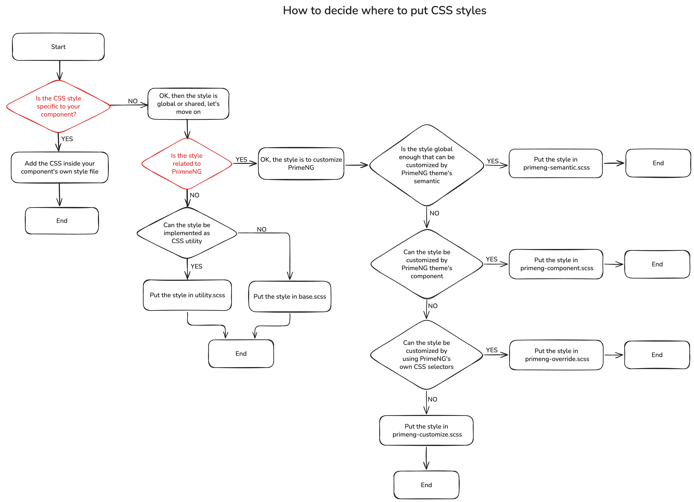

# CSS strategy

## Context

In web development, CSS can easily get messed up if no strategies/principles are applied. We should have a clear strategy on how to arrange CSSs and implement them in a consistent manner.

## Decision

- We follow a consistent approach to decide where to put different types of CSS styles
- We use [CSS layers](https://developer.mozilla.org/en-US/docs/Web/CSS/Reference/At-rules/@layer) to control the priorities of different types of styles

## Implementation

#### Decide where to put CSS styles

CSS styles can roughly been split into the following categories:

- Styles that are specific to your own components
- Styles that apply globally and target PrimeNG components
- Styles that apply globally but does not target PrimeNG components
- Utilities styles that can be shared/referenced by all components


Normally you add your CSS styles in the following places:

- The components' own CSS files: These files reside adjacent to your components' class files
- The `src/style` folder: This folder contains styles that are global or shared, with the following files:
  - `primeng/preset/primeng-components.ts`: This file contains customization to PrimeNG's individual components using [PrimeNG's theming mechanism](https://primeng.org/theming)
  - `primeng/preset/primeng-preset.ts`: This is the PrimeNG preset, normally you don't touch this file
  - `primeng/preset/primeng-sematic.ts`: This file contains customizations that are shared by all PrimeNG's components using PrimeNG's theming mechanism
  - `primeng/primeng-customize.scss`: This file contains you own styles for customizing PrimeNG components
  - `primeng/primeng-override.scss`: This file contains customization for PrimeNG's own CSS selectors
  - `base.scss`: This file contains globally applied styles and CSS variables
  - `reset.scss`: This file contains global styles for [CSS reset](https://meyerweb.com/eric/tools/css/reset/), normally you don't touch this file
  - `utility.scss`: This file contains utility styles that can be shared/referenced by all components

When you try to add CSS styles, go through the following steps to decide where to put the styles. (The red boxes are the key decision points. There are multiple files related to PrimeNG customization, pay attention to the their applying order.)




#### CSS layers

In practice, you don't quite need to touch css layers as they are already put in place for you. But a good understanding of the different layers' priority rules helps you better understand what's going on under the hood if you encounter some wired CSS issues.

The common principle for arranging css layers is that: default global styles should be put as lowest, followed by 3rd party components libraries(such as PrimeNG), your own component's styles should be of highest priority.

There are 5 CSS layers, from lowest priority to highest priority:

- `reset`: CSS reset, used only in `reset.scss`
- `base`: Base global styles, used only in `base.scss`
- `primeng`: PrimeNG components styles, those configured using PrimeNG's theme mechanism fall into this layer, such as `primeng-preset.ts`, `primeng-primitive.ts`, `primeng-sematic.ts` and `primeng-components.ts`. Other customization files, such as `primeng-override.scss` and `primeng-customize.scss`, do not belong to this layer, but stay unlayered.
- `utility`: Utility styles
- unlayered: Your own components' styles

The CSS layers priority is configured by `theme.options.cssLayer.order` in `main.config.ts`:

```typescript
    providePrimeNG({
      translation: all.zh_CN,
      theme: {
        preset: PRIMENG_PRESET,
        options: {
          cssLayer: {
            name: 'primeng',
            order: 'reset, base, primeng, utility'
          }
        }
      },
    }),
```
