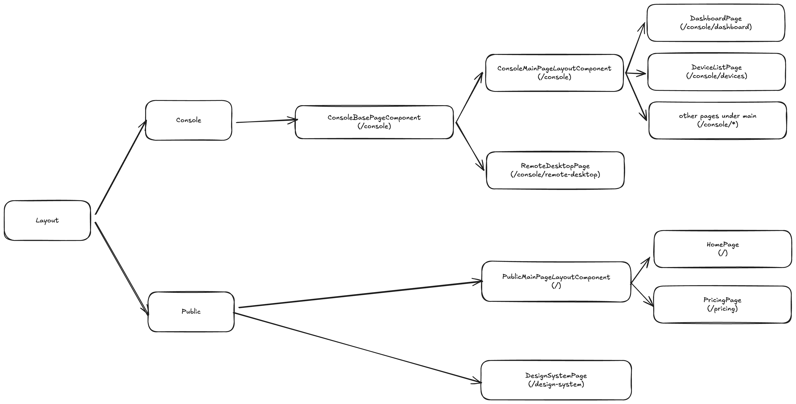

# Page layout structure

## Context

A consistent hierarchical page layout structure is easy to understand and good for maintenance.

## Decision

A page layout structure that covers both public pages and authenticated(console) pages is implemented.

## Implementation

- At a high level, the pages are split into two categories, one is public pages which does not require authentication
  and are accessible to everyone, the other is console pages which only authenticated users can access.
- All console pages are child pages of `ConsolePageBaseComponent`, this component is used to load user context data(such
  as user profile and user permission etc.) from backend servers before showing the console page.
- The `ConsolePageBaseComponent` is further split into the following sub categories:
  - `ConsolePageMainComponent` to cover all console pages which share the same layout containing a top bar and left
    navigation menu, such as `DashboardPage` and `DeviceListPage`.
  - Any other pages that have their own page layout, such as `RemoteDesktopPage`.
- All public pages are split into two categories:
  - Child pages of `PublicMainPageLayoutComponent`, these pages share the same page layout, such as `HomePage` and
    `PricingPage`.
  - Any other public pages that have their own page layout, such as `DesignSystemPage`.

  - 

